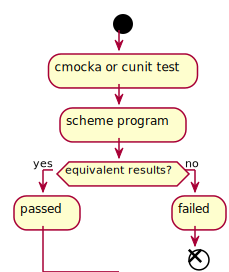

<h2>Table of Contents</h2>

<ul>
<li><a href="#org55fc997">1. Work-space for implementing algorithms and data structures</a>
<ul>
<li><a href="#org642dcda">1.1. Documentation</a></li>
<li><a href="#orge33f557">1.2. Testing</a></li>
</ul>
</li>
</ul>

# Work-space for implementing algorithms and data structures

This project is an attempt to gain skills in low level programming with memory management, awareness of structures and algorithms that work on this level. Most non-trivial algorithm will also be implemented in scheme to check against working programs. The scope of the project is very open this project is expected to continue for quite a while. 

## Documentation

The documentation is expected to be compiled for blog posting on each topic, so the working status may take a while. Current notes regarding implementation, testing and theory of each individual topic can be found in the *doc* sub folder of the project.

## Testing

Testing the data structures and algorithms is to be done extensively. In the current model a test is written with cmocka or cunit which operates over a input and the result is verified with the *scheme* program, which implements the same logic, operating over the same input.

